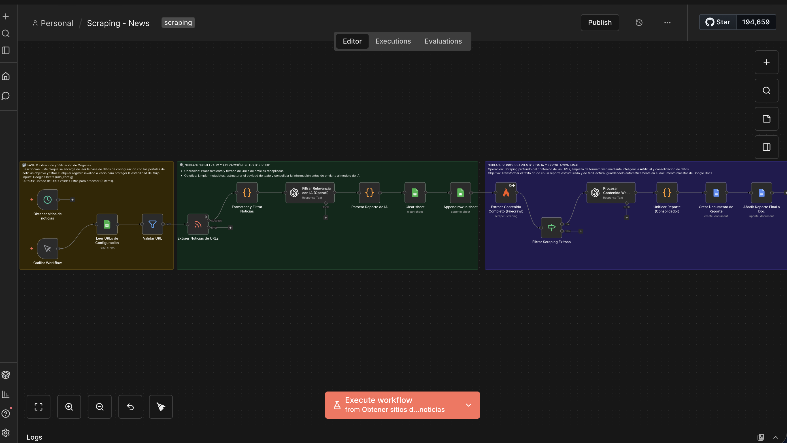
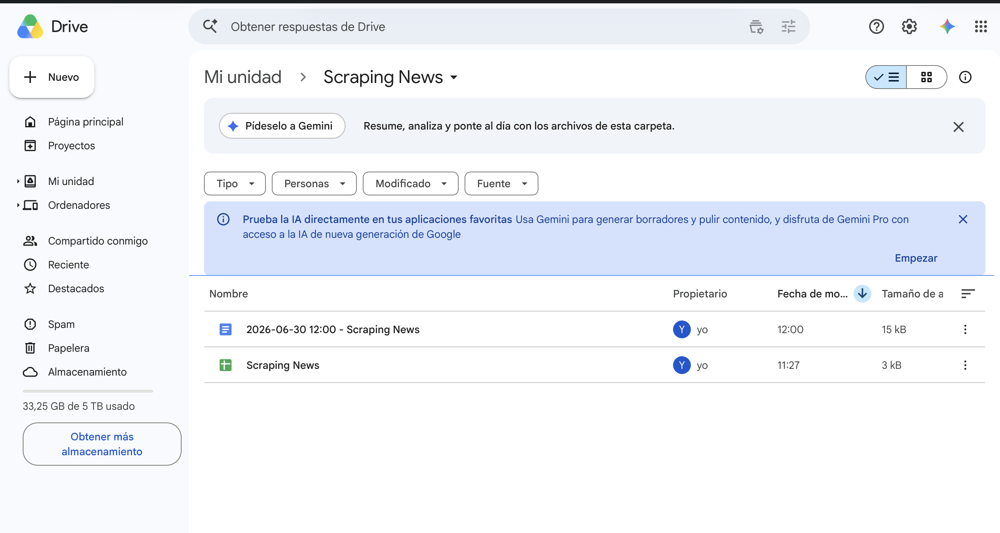

# 📰 AI News Scraping Automation (n8n + OpenAI + Firecrawl)

This repository contains an advanced n8n workflow designed to extract, filter, analyze, and consolidate news from RSS feeds utilizing Artificial Intelligence and deep Web Scraping.

## 🎯 Project Objective

To automate technological and informational surveillance. The system reads a list of sources (URLs), filters out noise using AI, extracts the full text of relevant news articles, and generates consolidated reports ready for human consumption in Google Docs and Google Sheets.

## 🏗️ Architecture and Technologies

* **Orchestrator:** n8n
* **Web Scraping:** Firecrawl API
* **Natural Language Processing (NLP):** OpenAI (GPT-4/GPT-3.5)
* **Storage and Reporting:** Google Workspace (Docs & Sheets)

## 💡 Advanced Features

1. **Modular and Decoupled Design:** Input sources (URLs) are managed from a Google Sheet (`urls_config`), allowing non-technical users to add or modify sources without altering the core n8n workflow.
2. **API Cost Optimization:** Implements a two-phase AI processing pipeline. First, a lightweight filter discards irrelevant news; second, deep processing (summarization and formatting) is executed exclusively for validated news.
3. **Resilience and Error Handling (Fault Tolerance):** The scraping node (Firecrawl) is configured with automatic retries and conditional routing (`If Node`). If a URL fails or times out, the error is caught silently and discarded, allowing the workflow to continue processing the remaining pipeline without interruption.

## 📸 Visual Demonstration

**Workflow Architecture in n8n:**

**Consolidated Output in Google Docs:**

## 📋 Prerequisites

Before importing this workflow, ensure you have the following ready in your environment:
* An active instance of **n8n** (Cloud or Self-Hosted).
* An **OpenAI API Key** with credits available.
* A **Firecrawl API Key** for deep web scraping.
* A **Google Cloud Project** with the Google Docs and Google Sheets APIs enabled, and a Service Account configured.

## 🚀 Installation and Setup

1. Clone this repository to your local machine or download the `n8n_ai_news_scraper.json` file.
2. In your n8n instance, navigate to **Workflows > Import from File** and select the JSON file.
3. Configure your credentials (see the Credentials section below).
4. Connect the input Google Sheet with your source URLs.
5. Activate the workflow.

## 🔐 Credentials & Environment Variables

To make this workflow fully operational, you must configure the following credentials within your n8n instance:

* **OpenAI API:** Create a new credential in n8n and paste your OpenAI API Key.
* **Firecrawl API:** Configure the HTTP Request nodes with your Bearer Token or Header Auth for Firecrawl.
* **Google Workspace API:** Set up your OAuth2 or Service Account credentials in n8n to grant read/write access to Google Docs and Google Sheets.
